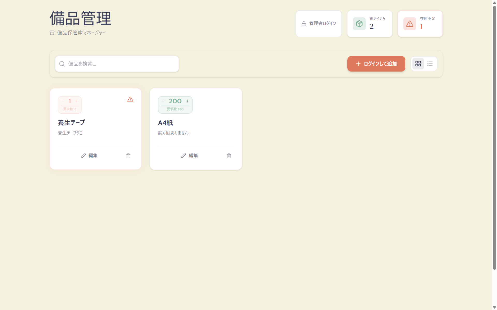
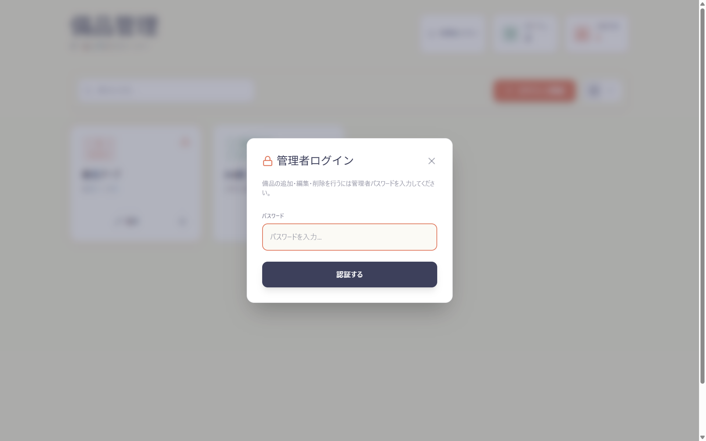
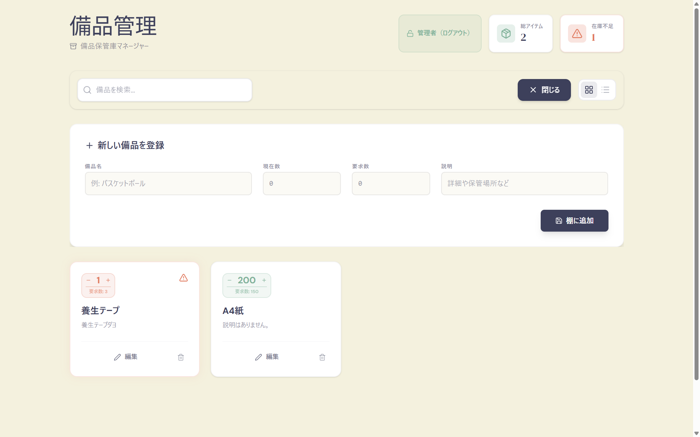
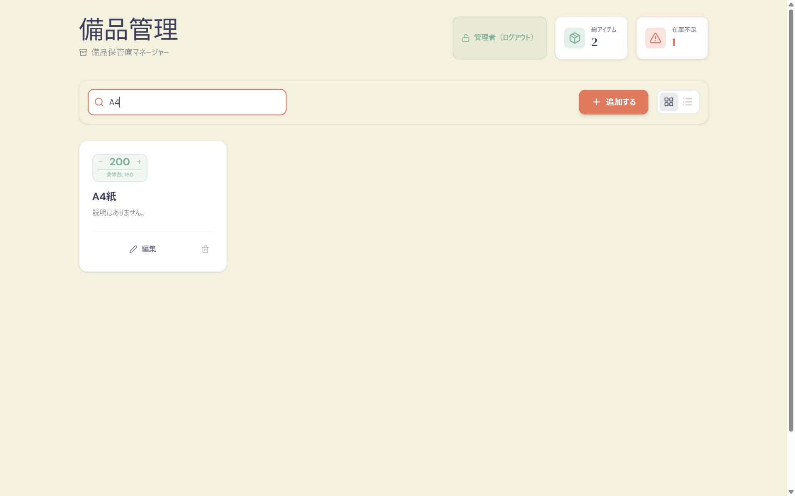
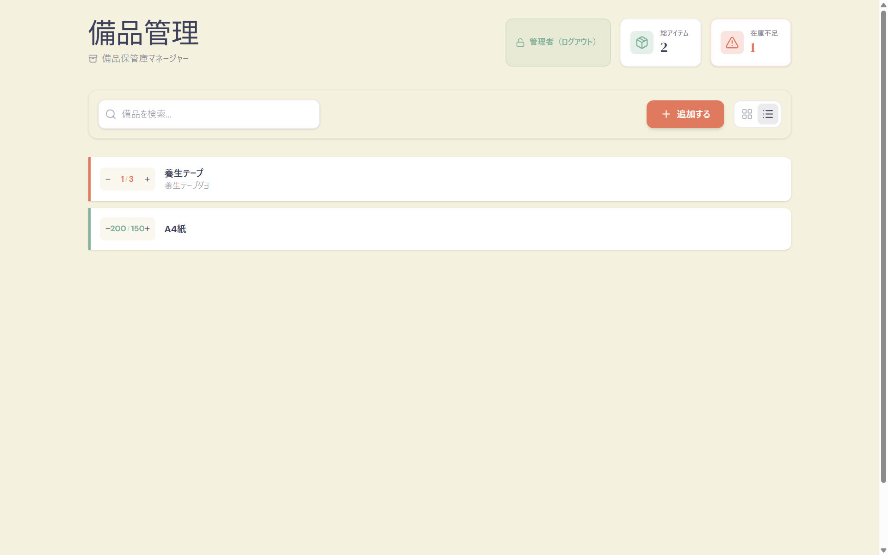

# 備品管理アプリ

備品の在庫管理を行うためのWebアプリケーションです。

## デプロイ先
https://next-app-tau-beige.vercel.app

## 開発期間
2026年2月10日 〜 2026年2月20日

## スクリーンショット
1. メインダッシュボード（グリッド表示）


2. リスト表示への切り替え


3. 備品登録・編集フォーム


4. 在庫不足のアラート表示


5. モバイル表示


## 主な機能
- 備品の一覧表示、検索、フィルタリング
- リスト形式とグリッド形式の表示切り替え
- 在庫数のインクリメント・デクリメント
- 備品の追加、編集、削除
- 在庫不足（要求数未満）のアイテムの強調表示

## 使用技術
- Next.js 15 (App Router)
- React 19
- Prisma
- PostgreSQL
- TailwindCSS 4
- Framer Motion

## セットアップ

1. 依存関係のインストール
```bash
npm install
```

2. データベースの設定
.envファイルを作成し、DATABASE_URLを設定してください。

3. データベースの反映
```bash
npx prisma generate
npx prisma db push
```

4. 開発サーバーの起動
```bash
npm run dev
```

## ライセンス
MIT
